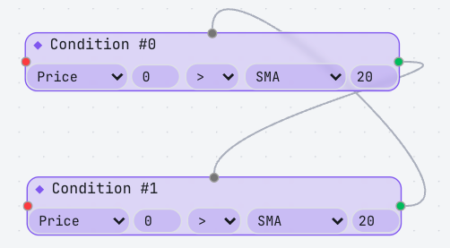

appena entrato sul sito:

1. Eventuale schermata di caricamento con sfondo sfocato

2. modal di intro
    - Learn how to build an algorithmic trading system through an hands-on approach!
    - Bottoni: Start the tutorial, I already know how to play

## Aggiungere nodi

quando aggiungi un nodo condizione al flow:

- gli indicatori coinvolti nella condizione vengono plottati (attenzione a non plottarlo più volte stesso indicatore con argomenti uguali se player aggiunge più nodi)
- l'indicatore aggiunto viene calcolato sull'intero storico disponibile

- il livello specifico usato dalla regola magari ha anche un tag tipo #12 (tag del nodo), che se clickato mette il nodo in focus nel flow chart.

nodo entry/exit:

- spunta puntino nel punto in cui si entrerebbe (rosso short, verde long)
  - se il nodo non ha una exit corrispondente, mostra tutti gli ipotetici puntini di entrata
  - se ha una exit (plottate tramite x), allora mostrale e collegale alla entry con un segmento.

### Logica dello schema

Il padre assoluto di un albero di condizioni deve avere l'input disabilitato, così da evitare loop infiniti, come in questo caso:

1. trova il padre assoluto di ogni nodo entry o exit non orfano

## Esecuzione strategia

Se non ci sono errori nella composizione del flow chart, quindi la strategia è eseguibile, a quel punto il tasto "test" viene abilitato.
Il testing della strategia viene effettuato nel backend in maniera vettorizzata.

## Chart strumenti

Opzioni:

- pausa
- regolazione velocità

L'utente può andare indietro col panning, fare replay sarebbe troppo complicato (a meno che non si renda comunque necessaria l'introduzione di una memoria nella classe StochasticProcesses).
